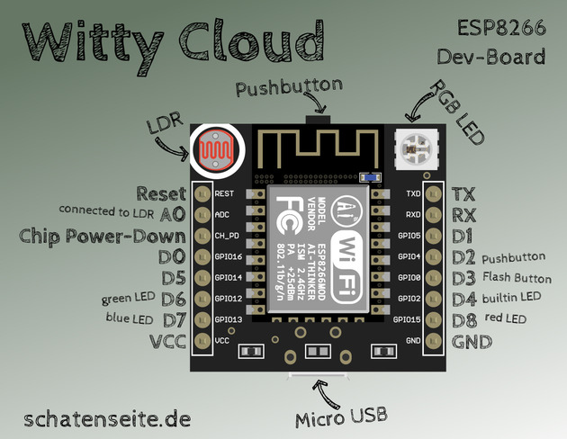
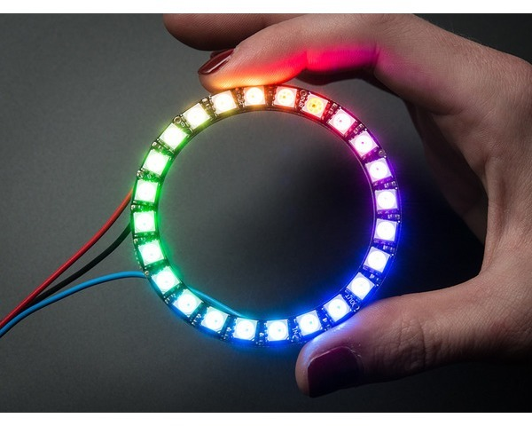

# What ?

From a informal meeting on saturday evening front of few beers we decide to do a IOT challenge. We came with the idea to do a  [pomodoro timer](https://en.wikipedia.org/wiki/Pomodoro_Technique).

# With what ?

I decide to choose the hardware for it. It will be base on some standard ESP-2866 (can be program like an arduino but with wifi built in).

I choose from a chinese website a copy of the [Esp8266 Witty](http://www.schatenseite.de/en/2016/04/22/esp8266-witty-cloud-module/), because there is already some sensors and leds built in.

 - light sensor
 - button
 - led
 - RGB led

 

Then to display easily the remaning time I choose a NeoPixel Ring module with 24 rgb leds.

# Next steps ?

 1. Write specs for standalone mode
 2. Write specs for connected mode
 3. Wait until the hardware arrived from china
 4. Learn and try with the hardware
